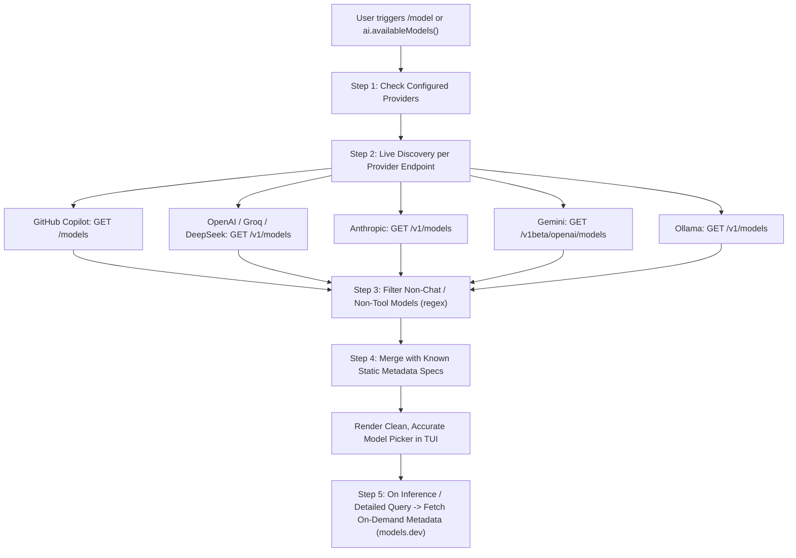

# Plan: Live Provider Model Discovery & On-Demand Metadata Hydration

## 1. Problem Statement & Motivation
Currently, when a user logs in with **GitHub Copilot**, **OpenRouter**, **Ollama**, or standard API keys:
- The `/model` picker relies primarily on `models.dev` (which does not have a separate catalog for `github-copilot`, and requires a network download of a full global JSON blob).
- If `models.dev` is offline or doesn't have a specific provider section, only a single synthetic model (`gpt-4o`) is shown.
- Authenticated accounts may have custom/preview access to models (e.g., Copilot Business / Enterprise enabled models) that static lists do not know about.

---

## 2. Architecture: Discovery + On-Demand Hydration

---

## 3. Step-by-Step Implementation Breakdown

### **Step 1: Implement `src/models/discovery.ts`**
Create a resilient, zero-dependency model discovery module that queries the authenticated provider endpoints:

1. **Provider Endpoint Matrix**:
   - **GitHub Copilot**: `GET https://api.individual.githubcopilot.com/models`
     - *Headers*: `Authorization: Bearer <token>`, `Editor-Version: vscode/1.99.0`, `Copilot-Integration-Id: vscode-chat`
     - *Filter*: `capabilities.supports.tool_calls !== false`
   - **OpenAI**: `GET https://api.openai.com/v1/models`
     - *Filter*: `gpt-*`, `o1*`, `o3*`, `chatgpt-*`
   - **Anthropic**: `GET https://api.anthropic.com/v1/models`
     - *Headers*: `x-api-key: <key>`, `anthropic-version: 2023-06-01`
     - *Filter*: `claude-*`
   - **Google Gemini**: `GET https://generativelanguage.googleapis.com/v1beta/openai/models`
     - *Filter*: `gemini-*`
   - **DeepSeek**: `GET https://api.deepseek.com/v1/models`
   - **Groq**: `GET https://api.groq.com/openai/v1/models`
   - **Mistral**: `GET https://api.mistral.ai/v1/models`
   - **OpenRouter**: `GET https://openrouter.ai/api/v1/models`
   - **Ollama**: `GET http://localhost:11434/v1/models`

2. **Non-Chat / Non-Coding Filter**:
   - Exclude embeddings, audio, moderation, tts, whisper (`/(embed|whisper|tts|transcribe|audio|dall-e|moderation|rerank)/i`).

3. **Per-Provider Parallel Execution & Error Isolation**:
   - Each provider fetch runs with a 5-second `AbortSignal.timeout(5000)`.
   - If one provider endpoint fails or is slow, other providers succeed without failing the overall discovery.

---

### **Step 2: Seed Known Standard Model Metadata (`src/models/defaults.ts`)**
- Maintain a lightweight static dictionary of common models and their known specifications (context window, max output tokens, reasoning flag) for instant offline fallback and immediate metadata enrichment:
  - `gpt-4o` (128k context, 16k output)
  - `claude-3-5-sonnet` / `claude-sonnet-4-5` (200k context, 8k output, reasoning)
  - `o1` / `o3-mini` (200k context, 100k output, reasoning)
  - `gemini-2.5-flash` / `gemini-2.5-pro` (1M+ context, reasoning)
  - `deepseek-chat` / `deepseek-reasoner` (64k context, reasoning)

---

### **Step 3: Wire Discovery into `client.ts` (`ai.availableModels()`)**
- Update `ai.availableModels()` in `packages/ai/src/client.ts`:
  1. Check configured providers via `isConfigured(p.id)`.
  2. For configured providers, run live discovery with resolved auth.
  3. Enrich discovered models with known metadata (or `models.dev` cache).
  4. Cache discovered models in-memory per provider with a 15-minute TTL.

---

### **Step 4: On-Demand Metadata Hydration (`ai.model(providerId, modelId)`)**
- If a model is selected that was newly discovered (not in static dictionary):
  - Check `models.dev` in-memory cache or query on demand.
  - If unavailable, generate a safe synthetic model definition with reasonable defaults (128k context, text/tool support).

---

### **Step 5: Testing & Verification**
1. **Unit Tests (`tests/discovery.test.ts`)**:
   - Mock provider endpoints (Copilot, OpenAI, Anthropic, Gemini, Ollama).
   - Test non-chat regex filtering.
   - Test timeout resilience and error isolation.
2. **Integration Test**:
   - Verify `ai.availableModels()` returns discovered models for configured providers.
   - Verify `bun run build` and `bun test packages/ai`.
